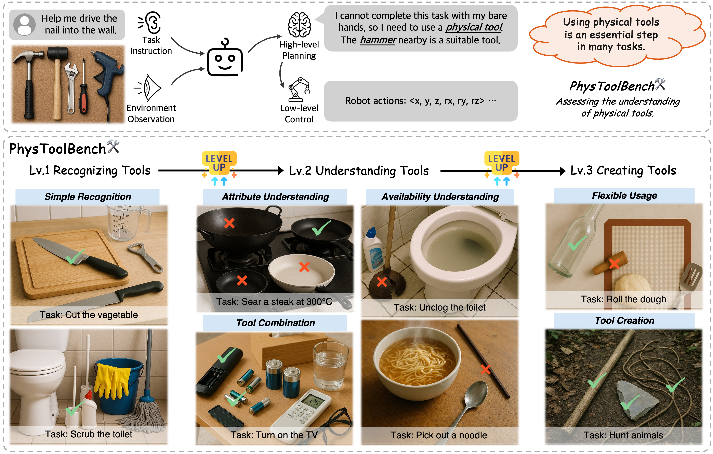

# PhysToolBench: Benchmarking Physical Tool Understanding for MLLMs
A basic implementation of ***PhysToolBench***.

## Introduction


> **"Man is a Tool-using Animal; without tools he is nothing, with tools he is all." --Thomas Carlyle**

The ability to use, understand, and create tools is a hallmark of human intelligence, enabling sophisticated interaction with the physical world. For any general-purpose intelligent agent to achieve true versatility, it must also master these fundamental skills. While modern Multimodal Large Language Models (MLLMs) leverage their extensive common knowledge for high-level planning in embodied AI and in downstream Vision-Language-Action (VLA) models, the extent of their true understanding of physical tools remains unquantified. To bridge this gap, we present PhysToolBench, the first benchmark dedicated to evaluating the comprehension of physical tools by MLLMs. Our benchmark is structured as a Visual Question Answering (VQA) dataset comprising over 1,000 image-text pairs. It assesses capabilities across three distinct difficulty levels: 1) Tool Recognition: Requiring the recognition of a tool's primary function. 2) Tool Understanding: Testing the ability to grasp the underlying principles of a tool's operation. 3) Tool Creation: Challenging the model to fashion a new tool from surrounding objects when conventional options are unavailable. Our comprehensive evaluation of 32 MLLMs—spanning proprietary, open-source, specialized embodied, and backbones in VLAs—reveals a significant deficiency in the tool understanding. Furthermore, we provide an in-depth analysis and propose preliminary solutions.


## Set up
* Environment
```shell
git clone https://github.com/PhysToolBench/PhysToolBench.git
cd PhysToolBench
pip install -r requirements.txt
```
* Download the dataset
```shell

```

## Inference
You can run MLLMs in two ways to evaluate it on the PhysToolBench:
1. Use the API of the proprietory MLLMs:
    ``` shell
    python src/inference.py --model_name gpt-5 --api_url https://xxxxxx --api_key "sk-xxxxxx" # Put your own API URL and API key here
    ```
2. Download the Open-Source model and run it locally:

    To facilitate large-scale inference, we deploy the open-source models as server that can be accessed via API.
    
    2.1. Start the server:
    ```shell
    python vlm_local/Qwen-2.5VL/qwen_2_5vl_server.py --port 8004 # deploy the qwen-2.5-vl server on port 8004
    ```
    2.2. Run the MLLM:
    ```shell
    python src/inference.py --model_name qwen-2.5-vl-7B --api_url http://localhost:8004 --api_key "" # Evaluate the qwen-2.5-vl-7B model
    ```


## Acknowledgement
Our code are built upon the following repositories:
- [VGRP-Bench](https://github.com/ryf1123/VGRP-Bench)
- [FractFlow](https://github.com/EnVision-Research/FractFlow)